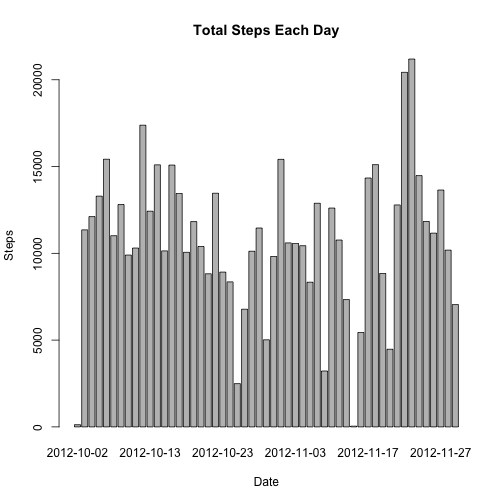
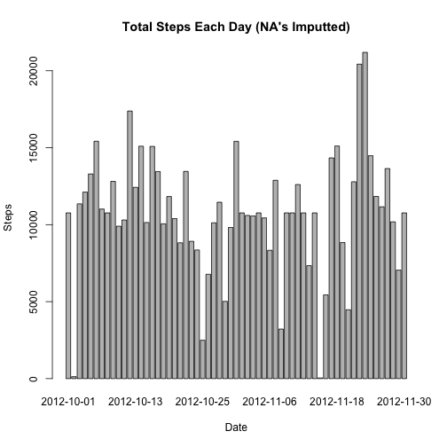

Reproducible research - Assignment 1 
========================================================

###Loading and preprocessing the data

First load the data


```r
if (!file.exists("repdata-data-activity.zip")) {
  download.file("http://d396qusza40orc.cloudfront.net/repdata%2Fdata%2Factivity.zip","./repdata-data-activity.zip")
  unzip("./repdata-data-activity.zip")
}

actdata <- read.csv("./activity.csv")
```

Load required packages 

```r
library(plyr)
library(chron)
```

###What is mean total number of steps taken per day?

Create histogram of total number of steps taken each day


```r
Total_Steps <- aggregate(steps ~ date, actdata, sum)
barplot(Total_Steps$steps, names = Total_Steps$date, ylab = "Steps", xlab = "Date", 
      main = "Total Steps Each Day")
```

 

Calculate and report the mean and median total number of steps taken per day


```r
median(Total_Steps[,2])
```

```
## [1] 10765
```

```r
mean(Total_Steps[,2])
```

```
## [1] 10766
```

###What is the average daily activity pattern?

Make a time series plot (i.e. type = "l") of the 5-minute interval (x-axis) and the average number of steps taken, averaged across all days (y-axis)


```r
Activity_Average <- aggregate(steps ~ interval, actdata, mean)

plot(Activity_Average$interval, Activity_Average$steps, type ="l", ylab = "Average Steps", xlab = "Interval", main = "Average Steps by Time Interval")
```

 

```r
##barplot(Activity_Average$steps, names = Activity_Average$interval, ylab = "Average Steps", xlab = "Interval", main = "Average Steps by Time Interval")
```

Which 5-minute interval, on average across all the days in the dataset, contains the maximum number of steps?


```r
Activity_Average[grep(max(Activity_Average[,2]),Activity_Average[,2]),1]
```

```
## [1] 835
```

###Imputing missing values

Calculate and report the total number of missing values in the dataset (i.e. the total number of rows with NAs)


```r
sum(is.na(actdata))
```

```
## [1] 2304
```

Devise a strategy for filling in all of the missing values in the dataset. The strategy does not need to be sophisticated. For example, you could use the mean/median for that day, or the mean for that 5-minute interval, etc.

**My solution: I will be filling in the missing values with the average of that time interval.**

Create a new dataset that is equal to the original dataset but with the missing data filled in


```r
# copy dataset to preserve original 
actdata_imput <- actdata

# add column to dataset with average steps by time interval 
mergeddata <- join(actdata_imput, Activity_Average, by = "interval")

# loop through the merged dataset, replacing "NA"s with averages 
for (i in 1:nrow(mergeddata) ) {
  if (is.na(mergeddata[i,1])) {
    mergeddata[i,1] <- mergeddata[i,4]
  }
}

# remove column of averages now that NA's have been replaced
mergeddata <- mergeddata[,1:3]
```

Make a histogram of the total number of steps taken each day...


```r
Merged_Steps <- aggregate(steps ~ date, mergeddata, sum)
barplot(Merged_Steps$steps, names = Merged_Steps$date, ylab = "Steps", xlab = "Date", 
      main = "Total Steps Each Day (NA's Imputted)")
```

 

 ...and calculate and report the mean and median total number of steps taken per day.


```r
median(Merged_Steps[,2])
```

```
## [1] 10766
```

```r
mean(Merged_Steps[,2])
```

```
## [1] 10766
```


Do these values differ from the estimates from the first part of the assignment? What is the impact of imputing missing data on the estimates of the total daily number of steps?


```r
#Calculate difference between medians before and after the NA replacement
median(Merged_Steps[,2])-median(Total_Steps[,2])
```

```
## [1] 1.189
```

```r
#Calculate difference between means before and after the NA replacement
mean(Merged_Steps[,2])-mean(Total_Steps[,2])
```

```
## [1] 0
```

**A: The median is 1.189 steps higher after replacing the NA's, but the mean is the same.**

###Are there differences in activity patterns between weekdays and weekends?

Create a new factor variable in the dataset with two levels – “weekday” and “weekend” indicating whether a given date is a weekday or weekend day.


